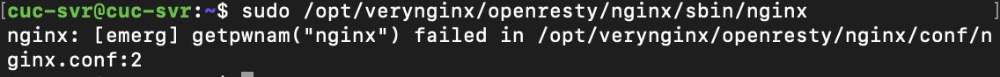

# 第五章：Web服务器

## 软件环境

### **Nginx**

### **VeryNginx**

### **Wordpress4.7**

### **Damn Vulnerable Web Application (DVWA)**

## 基本要求

### 在一台主机（虚拟机）上同时配置Nginx和VeryNginx

#### VeryNginx作为本次实验的Web App的反向代理服务器和WAF

**访问VeryNginx管理面板:**

#### PHP-FPM进程的反向代理配置在nginx服务器上，VeryNginx服务器不直接配置Web站点服务

### 使用Wordpress搭建的站点对外提供访问的地址为： <http://wp.sec.cuc.edu.cn>

**访问wordpress:**

### 使用Damn Vulnerable Web Application (DVWA)搭建的站点对外提供访问的地址为： <http://dvwa.sec.cuc.edu.cn>

## 安全加固要求

### 使用IP地址方式均无法访问上述任意站点，并向访客展示自定义的友好错误提示信息页面-1

### Damn Vulnerable Web Application (DVWA)只允许白名单上的访客来源IP，其他来源的IP访问均向访客展示自定义的友好错误提示信息页面-2

### 在不升级Wordpress版本的情况下，通过定制VeryNginx的访问控制策略规则，热修复WordPress < 4.7.1 - Username Enumeration

### 通过配置VeryNginx的Filter规则实现对Damn Vulnerable Web Application (DVWA)的SQL注入实验在低安全等级条件下进行防护

## VeryNginx配置要求

### VeryNginx的Web管理页面仅允许白名单上的访客来源IP，其他来源的IP访问均向访客展示自定义的友好错误提示信息页面-3

### 通过定制VeryNginx的访问控制策略规则实现

#### 限制DVWA站点的单IP访问速率为每秒请求数 < 50

#### 限制Wordpress站点的单IP访问速率为每秒请求数 < 20

#### 超过访问频率限制的请求直接返回自定义错误提示信息页面-4

#### 禁止curl访问

## 实验遇到的问题（已解决）

    <1>启动veryNginx报错

    <1>添加Nginx用户组

    <2>mysql为root设置密码报错

    <2>修改密码策略

    <3>重新加载Nginx失败

    <3>启动Nginx再加载

## 配置过程截图

    配置mysql

    检查配置文件语法错误

    检查wordpress修改配置文件成功

## 实验中遇到的问题（未解决）

安装并配置完Nginx、VeryNginx、wordpress后，通过IP进行访问成功，为了完成**安全加固**要求中的第一条要求，使用web端访问Wordpress，在setting界面修改了site url之后，无法再访问该网页，导致后续要求没有通过web端设置来完成。

## 参考文献

<https://www.digitalocean.com/community/tutorials/how-to-install-linux-nginx-mysql-php-lemp-stack-ubuntu-18-04>

<https://www.digitalocean.com/community/tutorials/how-to-install-wordpress-with-lemp-on-ubuntu-18-04>
