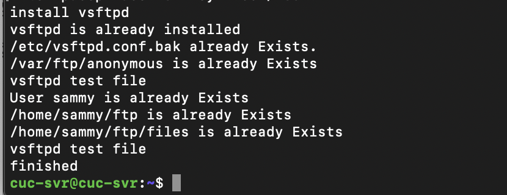

# 第六章：shell脚本编程练习进阶（实验）

## FTP、NFS、DHCP、DNS、Samba服务器的自动安装与自动配置

### 软件环境建议

#### 对照第6章课件中的要求选择一款合适的FTP服务器软件支持所有任务要求

### 软件环境

#### **工作主机：ubuntu18.04.4(10.211.55.6)**

#### **目标主机：ubuntu18.04.4(10.211.55.12)**

- FTP

  - 配置一个提供匿名访问的FTP服务器，匿名访问者可以访问1个目录且仅拥有该目录及其所有子目录的只读访问权限；
  - 配置一个支持用户名和密码方式访问的账号，该账号继承匿名访问者所有权限，且拥有对另1个独立目录及其子目录完整读写（包括创建目录、修改文件、删除文件等）权限；
    - 该账号仅可用于FTP服务访问，不能用于系统shell登录；
  - FTP用户不能越权访问指定目录之外的任意其他目录和文件；
  - 匿名访问权限仅限白名单IP来源用户访问，禁止白名单IP以外的访问；
  - （可选加分任务）使用FTPS服务代替FTP服务，上述所有要求在FTPS服务中同时得到满足；

- NFS

  - 在1台Linux上配置NFS服务，另1台电脑上配置NFS客户端挂载2个权限不同的共享目录，分别对应只读访问和读写访问权限；
  - 实验报告中请记录你在NFS客户端上看到的：
    - 共享目录中文件、子目录的属主、权限信息
    - 你通过NFS客户端在NFS共享目录中新建的目录、创建的文件的属主、权限信息
    - 上述共享目录中文件、子目录的属主、权限信息和在NFS服务器端上查看到的信息一样吗？无论是否一致，请给出你查到的资料是如何讲解NFS目录中的属主和属主组信息应该如何正确解读
  - （可选加分任务）在客户端或NFS服务器上抓包分析使用NFS协议时的远程文件下载、上传、移动、删除等操作是否是明文？远程的文件传输数据流是否可以被恢复出完整的传输文件？
    - 提示：我们在《网络安全》第4章《网络监听》中介绍过的工具filesnarf

- DHCP

  - 2台虚拟机使用Internal网络模式连接，其中一台虚拟机上配置DHCP服务，另一台服务器作为DHCP客户端，从该DHCP服务器获取网络地址配置

- Samba

  - 对照以下3点任务要求完成Samba服务器配置和客户端配置连接测试
  - Linux访问Windows的匿名共享目录
  - Linux访问Windows的用户名密码方式共享目录
  - [下载整个目录](https://indradjy.wordpress.com/2010/04/14/getting-whole-folder-using-smbclient/)

- DNS
  - 基于上述Internal网络模式连接的虚拟机实验环境，在DHCP服务器上配置DNS服务，使得另一台作为DNS客户端的主机可以通过该DNS服务器进行DNS查询
  - 在DNS服务器上添加 `zone "cuc.edu.cn"` 的以下解析记录

```html
ns.cuc.edu.cn NS
ns A <自行填写DNS服务器的IP地址>
wp.sec.cuc.edu.cn A <自行填写第5章实验中配置的WEB服务器的IP地址>
dvwa.sec.cuc.edu.cn CNAME wp.sec.cuc.edu.cn
```

### shell脚本编程基本要求

- 目标测试与验证系统为本学期课程指定操作系统版本
- 自动安装与自动配置过程的启动脚本要求在本地执行
  - ***提示***：配置远程目标主机的SSH免密root登录，安装脚本、配置文件可以从工作主机（执行启动脚本所在的主机）上通过scp或rsync方式拷贝或同步到远程目标主机，然后再借助SSH的***远程命令执行***功能实现远程控制安装和配置

- 假设目标系统没有配置过root用户免密登录，所以我们要求在自动安装脚本中包含自动配置远程root用户免密登录的代码
- 脚本在执行过程中，如果需要在目标主机上创建目录、创建临时文件、执行网络下载等操作需要判断执行是否成功，并进行必要的异常处理（例如：apt-get update失败，则退出脚本执行，并将友好错误信息打印在控制台上。临时目录不存在，则自动创建该临时目录）
- 所有服务的配置文件、临时目录需设置正确的目录和文件归属和权限位，禁止使用***777\***这种偷懒的权限位设置
- 减少不必要的安装过程中的人机交互输入，尽可能全部通过脚本的方式完成选项设置和交互式问题输入等

- 目标环境相关参数应使用独立的配置文件或配置脚本（在主调脚本中引用配置脚本）
  - 目标服务器IP
  - 目标服务器SSH服务的端口
  - 目标服务器上使用的用户名
  - 目标服务器上用于临时存储安装脚本、配置文件的临时目录路径

### 其他要求

- 撰写实验报告，证明你具体完成了哪些任务要求
- 所有脚本代码、配置文件均应包含在你的作业PR之中
- 脚本应在纯净未配置任何目标服务的系统和已完全配置好所有目标服务的系统2种典型测试用例条件下均能测试通过
  - 对于在目标系统上已完成配置的服务，允许用本地的配置文件去覆盖远程已有的配置文件，但在执行***覆盖***操作之前应对远程已有的配置文件进行***妥善***备份

### 实验内容

FTP自动配置

NFS自动配置

DHCP（有错误）

DNS手动配置

Samba（无Windows系统）

### 实验过程

#### 配置远程目标主机的SSH免密root登录

```bash
#目标主机
sudo vim /etc/ssh/sshd_config//修改ssh配置文件,添加如下内容：
 PasswordAuthentication yes
 PermitRootLogin yes
sudo systemctl restart ssh//重启ssh

#工作主机
ssh-keygen -f .ssh/foo//生成公私钥对foo
ssh-copy-id -i ~/.ssh/foo root@10.211.55.12//传公钥到目标主机

#目标主机
sudo vim /etc/ssh/sshd_config//修改ssh配置文件
 PasswordAutehntication no
 PermitRootLogin without-password
sudo systemctl restart ssh//重启ssh

#解决设置完之后，每次还提示”Enter passphrase for key ‘/root/.ssh/foo’:“(仅本次登录有效)
eval $(ssh-agent)
ssh-add foo//添加私钥到agent
```

##### 免密登陆成功


#### FTP

**vsftpd**

- 将脚本文件vsftpd.sh从工作主机拷贝到目标主机

`scp -i .ssh/foo ~/mac/hw6/vsftpd.sh root@10.211.55.12:~/hw6`


- 运行脚本文件实现安装和配置


- Error:已经检查***Vsftpd.conf***中已添加`no_anon_password=YES`，但使用anonymous登录时仍被要求输入密码
- Error:设置用户sammy的密码为123456，但输入后仍然无法成功登陆
  - 解决（未成功）：把***/etc/pam.d/vsftpd***文件中的 `auth required pam_listfile.so item=user sense=deny file=/etc/vsftpd/ftpusers onerr=succeed` 这一句注释掉。


- 由于登录无法成功，再次执行脚本文件确认命令已经执行成功



- 匿名访问权限仅限白名单IP来源用户访问，禁止白名单IP以外的访问


#### NFS

- 将脚本文件nfs_server.sh从工作主机拷贝到目标主机，目标主机运行nfs_server.sh

`scp -i .ssh/foo ~/mac/hw6/nfs_server.sh root@10.211.55.12:~/hw6`

- 工作主机运行nfs_client.sh

- nfs只读目录/读写目录

  

- 访问权限


- client与server


- no_rs与rs


#### DHCP

- 2台虚拟机使用Internal网络模式连接


- 将脚本文件dhcp.sh从工作主机拷贝到目标主机，目标主机运行dhcp.sh


- Error 


#### DNS

**server**

- 安装bind9

`sudo apt install bind9`

- 修改配置文件named.conf.options

`sudo vim /etc/bind/named.conf.options`

```shell
# 添加内容
listen-on { 192.168.57.1; };
allow-transfer { none; };
forwarders {
    8.8.8.8;
    8.8.4.4;
};
```

- 修改配置文件named.conf.local

`sudo vim /etc/bind/named.conf.local`

```shell
# 添加内容
zone "cuc.edu.cn" {
    type master;
    file "/etc/bind/db.cuc.edu.cn";
};
```

- 生成配置文件db.cuc.edu.cn

`sudo cp /etc/bind/db.local /etc/bind/db.cuc.edu.cn`

- 修改配置文件db.cuc.edu.cn

`sudo vim /etc/bind/db.cuc.edu.cn`

```shell
;
; BIND data file for local loopback interface
;
$TTL    604800
;@      IN      SOA     localhost. root.localhost.(

@       IN      SOA     cuc.edu.cn. admin.cuc.edu.cn. (
                            2         ; Serial
                        604800         ; Refresh
                        86400         ; Retry
                        2419200         ; Expire
                        604800 )       ; Negative Cache TTL
;
;@      IN      NS      localhost.
        IN      NS      ns.cuc.edu.cn.
ns      IN      A       192.168.57.1
wp.sec.cuc.edu.cn.      IN      A       192.168.57.1
dvwa.sec.cuc.edu.cn.    IN      CNAME   wp.sec.cuc.edu.cn.
@       IN      AAAA    ::1
```

- 重启bind9

`sudo systemctl restart bind9.service`

**client**

- 安装resolvconf

`sudo apt install resolvconf`

- 修改配置文件resolv.conf.d/head

`sudo vim /etc/resolvconf/resolv.conf.d/head`

```shell
#添加内容
search cuc.edu.cn
nameserver 10.211.55.12
```

**结果**


### 参考文献

#### ssh免密登陆

<https://blog.51cto.com/meiling/2071122>

<https://askubuntu.com/questions/115151/how-to-set-up-passwordless-ssh-access-for-root-user>

<https://blog.csdn.net/qq_31977125/article/details/102736460>

#### vsftpd

<https://www.digitalocean.com/community/tutorials/how-to-set-up-vsftpd-for-a-user-s-directory-on-ubuntu-18-04>

#### nfs

<https://www.digitalocean.com/community/tutorials/how-to-set-up-an-nfs-mount-on-ubuntu-18-04>

#### dhcp

<https://help.ubuntu.com/community/isc-dhcp-server>

https://c4pr1c3.github.io/LinuxSysAdmin/cloud-init.md.html#/13/6

#### 其它

<https://github.com/CUCCS/linux-2019-luyj/blob/Linux_exp0x06/Linux_exp0x06/Linux_exp0x06.md>