控制主机A:**10.211.55.6**

被管理主机B:**10.211.55.12**

## 安装ansible到A主机

```shell
sudo apt-get install ansible

ansible --version#查看版本
#ansible 2.5.1

#通过 Python 的包管理器 pip 进行安装
pip freeze | grep ansible#查看当前系统中已通过 pip 安装的 ansible 版本信息
#ansible==2.5.1

# 搜索最新版 ansible 候选安装包信息
pip search ansible
#ansible (2.9.9)                              - Radically simple IT automation
#  INSTALLED: 2.5.1
#  LATEST:    2.9.9

# 升级 pip 方式安装的ansible,临时使用清华 pypi 镜像源
pip install -i https://pypi.tuna.tsinghua.edu.cn/simple -U ansible
#Successfully installed MarkupSafe-1.1.1 PyYAML-5.3.1 ansible-2.9.9 cffi-1.14.0 cryptography-2.9.2 enum34-1.1.10 ipaddress-1.0.23 jinja2-2.11.2 pycparser-2.20 six-1.15.0

pip freeze | grep ansible#查看当前系统中已通过 pip 安装的 ansible 版本信息
#ansible==2.9.9
```

## 安装python3解释器到B主机

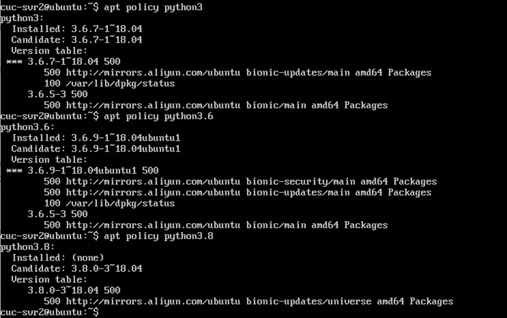

```shell
sudo apt install python3#安装
python3 --version#查看版本
#python3.6.9
```

## 使用ansible设置A到B的ssh免密登陆

- 配置vscode远程控制A主机

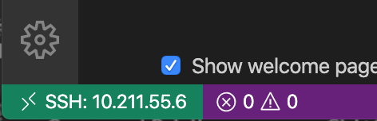

- 将Ansible-Tutorial放到A主机 /home/cuc-svr/workspace

- 更改相关配置

```shell
#对于ssh-copy-id.yml
  - name: deploy local rsa pub to remote host
    authorized_key: 
      user: cuc-svr2
      state: present
      key: "{{ lookup('file', lookup('env','HOME') + '/.ssh/foo.pub') }}"
#    become: true 
#    become_user: root
#    become_method: su 

#对于hosts
[ssh-copy-id]
cuc-svr2 ansible_ssh_host=10.211.55.12 ansible_ssh_user=cuc-svr2 ansible_ssh_port=22 ansible_become_pass="{{ become_pass }}" ansible_ssh_pass="{{ become_pass }}"

#对于group_vars/ssh-copy-id.yml
become_pass: "password"
```

- 解决报错

```shell
#fatal: [debian-www]: FAILED! => {"msg": "to use the 'ssh' connection type with passwords, you must install the sshpass program"}
sudo apt update&&sudo apt install sshpass#安装sshpass
```

- 部署成功

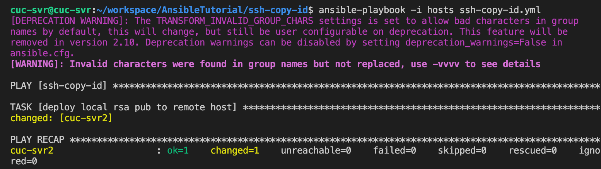

- 免密登陆仍然需要输入密码

```shell
#对主机A
eval $(ssh-agent)
ssh-add ～/foo#添加私钥到agent
```

- 免密登陆**cuc-svr2**成功

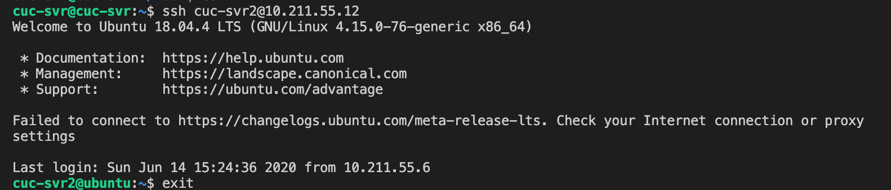

- 免密登陆**root**成功

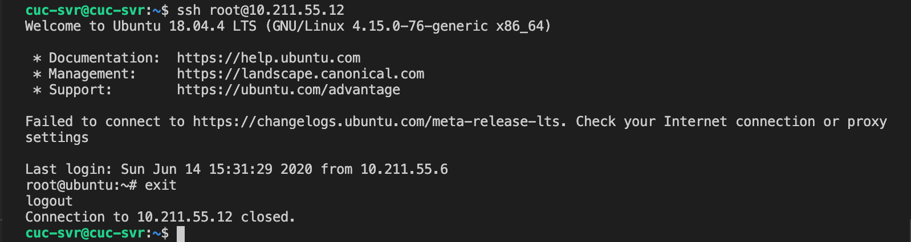

### FTP

#### vsftpd

- 在A主机运行**vsftpd.yml**文件为B主机安装和配置vsftpd

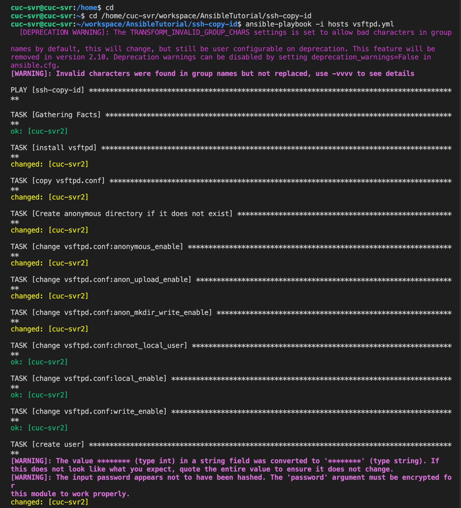

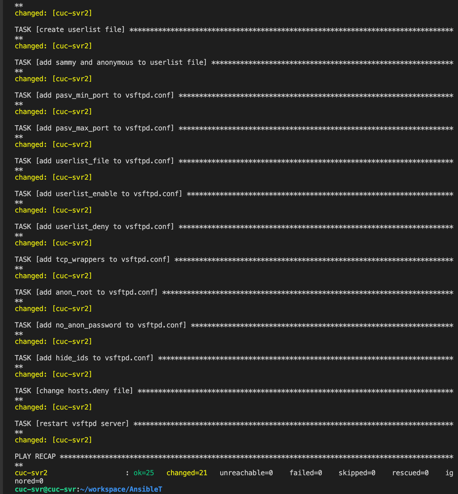

- 测试

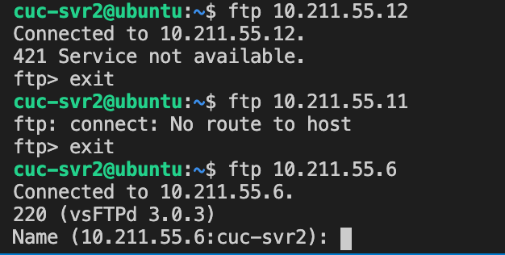

**ERROR**

检查了vsftpd.conf、vsftpd.userlist、hosts.deny，均已按要求更改，但是在使用添加的用户sammy和密码登录时显示密码错误，用anonymous登录时仍要求输入密码。

## NFS

- 在A主机运行**nfs_server.sh**文件为B主机安装和配置NFS服务

**ERROR**

运行copy exports 复制配置文件时报错

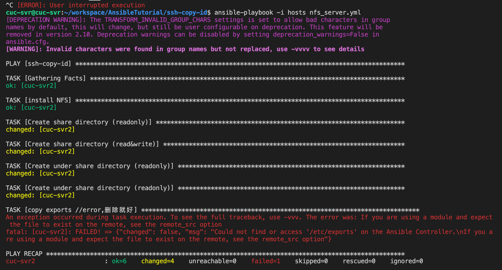

通过 **-vvv**再次运行命令查看详细报错

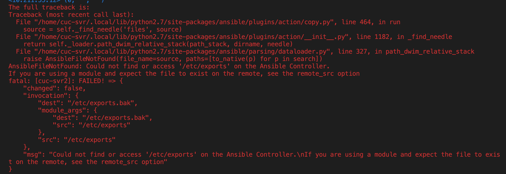

在copy exports的copy命令下增加一行`remote_src: true`，说明文件在远程主机上，解决报错

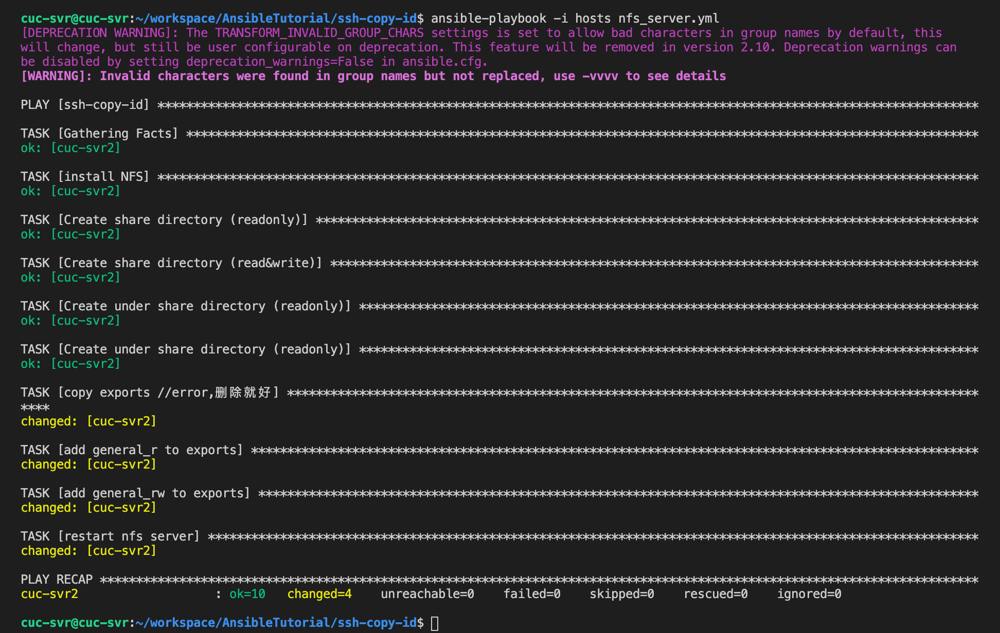

- 在A主机运行**nfs_client.sh**文件配置NFS客户端挂载2个权限不同的共享目录

**ERROR**

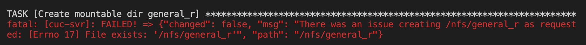

应该是因为这台主机上次作业已经挂载过了，取消挂载删除文件夹解决

```bash
#取消挂载
cuc-svr@cuc-svr:/nfs$ sudo su
root@cuc-svr:/nfs# umount -l  /rs  
umount: /rs: no mount point specified.##来源不存在,这是因为我当前在/nfs文件夹
root@cuc-svr:/nfs# cd
root@cuc-svr:~# umount -v /nfs/rs
/nfs/rs: nfs4 mount point detected
/nfs/rs: umounted###成功
root@cuc-svr:~# umount -v /nfs/no_rs
/nfs/no_rs: nfs4 mount point detected
/nfs/no_rs: umounted
root@cuc-svr:~# umount -v /nfs/general_r
/nfs/general_r: nfs4 mount point detected
/nfs/general_r: umounted
root@cuc-svr:~# umount -v /nfs/general_rw
/nfs/general_rw: nfs4 mount point detected
/nfs/general_rw: umounted
#删除文件夹
root@cuc-svr:/nfs# ls
general_r  general_rw  no_rs
root@cuc-svr:/nfs# rm -rf no_rs
root@cuc-svr:/nfs# rm -rf general_r
root@cuc-svr:/nfs# rm -rf general_rw
root@cuc-svr:/nfs# ls
root@cuc-svr:/nfs# exit
```

**ERROR**

创建文件夹的时候出现问题，可以确定密码没错，查看了两个文件的权限也没错

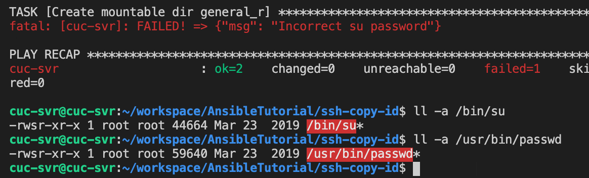

改become_method为sudo后

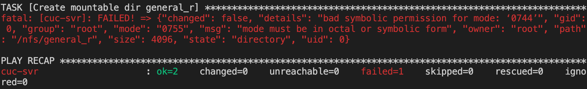

## DHCP

在A主机运行**dhcp.yml**文件为B主机安装和配置vsftpd

**ERROR**

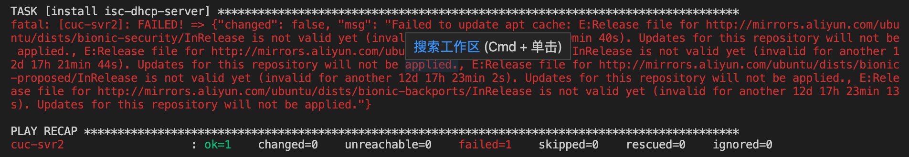

修正B主机的系统时间

```bash
date #查看当前系统时间，发现错误
date -s "正确时间"
hwclock -systohc #同步系统时间和硬件时间
date #查看是否已经修改正确
```

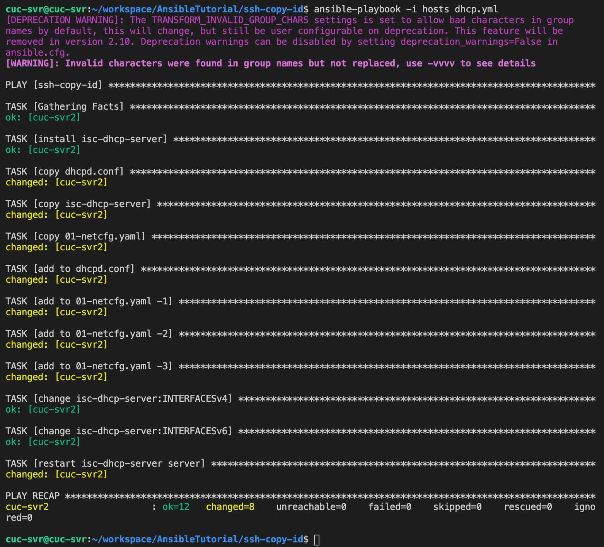

## DNS

在A主机运行**dns_server.yml**文件为B主机安装和配置dns

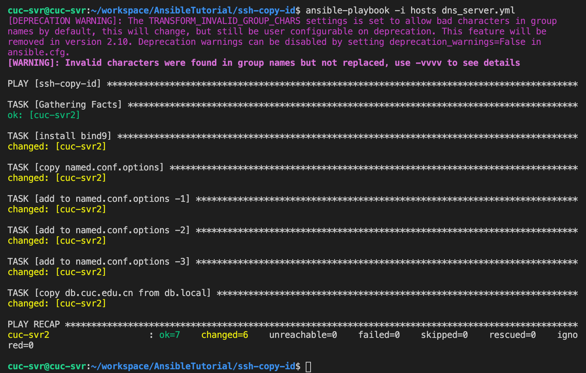

查看配置文件db.cuc.edu.cn

```bash
sudo vim /etc/bind/db.cuc.edu.cn
# 内容如下
;
; BIND data file for local loopback interface
;
$TTL    604800
@       IN      SOA     localhost. root.localhost. (
                              2         ; Serial
                         604800         ; Refresh
                          86400         ; Retry
                        2419200         ; Expire
                         604800 )       ; Negative Cache TTL
;
@       IN      NS      localhost.
@       IN      A       127.0.0.1
@       IN      AAAA    ::1
~                                                                                                            
~  
# 内容如上

# 可知需要修改内容如下
# 添加 
        IN      NS      ns.cuc.edu.cn.
ns      IN      A       192.168.57.1
wp.sec.cuc.edu.cn.      IN      A       192.168.57.1
dvwa.sec.cuc.edu.cn.    IN      CNAME   wp.sec.cuc.edu.cn.
# 删除 
@       IN      A       127.0.0.1
```

修改完成

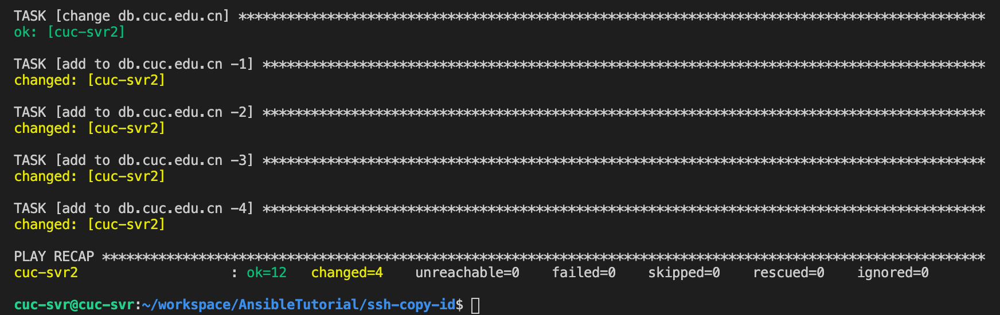

- 在A主机运行**dns_client.yml**文件为A主机安装和配置dns

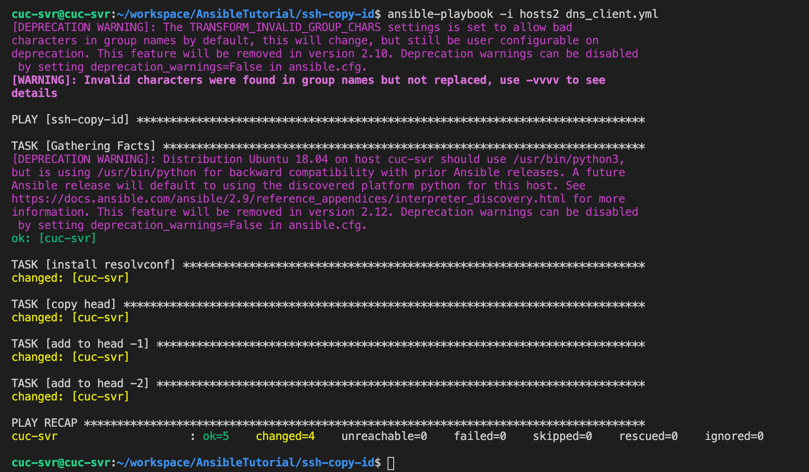

验证

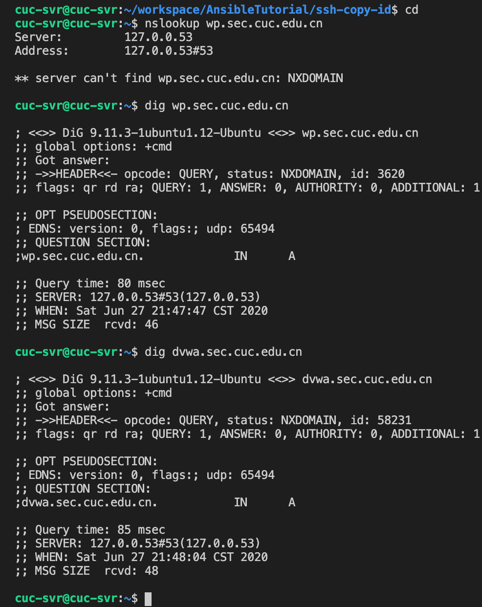

## samba

自动安装

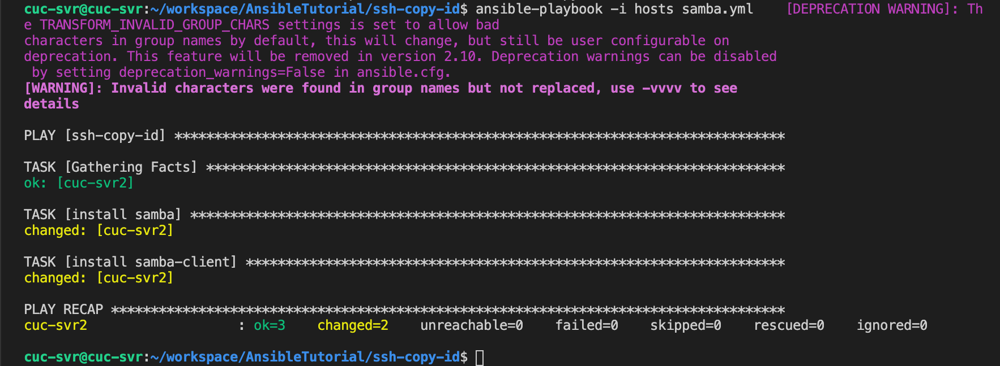

