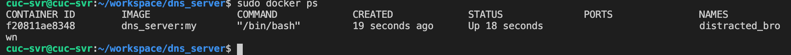

## 安装Doker

```bash
sudo apt-get update
# 使用https库
sudo apt-get install apt-transport-https ca-certificates curl software-properties-common
# 添加docker的使用的公钥
curl -fsSL https://download.docker.com/linux/ubuntu/gpg | sudo apt-key add -
# 添加docker的远程库
sudo add-apt-repository "deb [arch=amd64] https://mirrors.aliyun.com/docker-ce/linux/ubuntu $(lsb_release -cs) stable"
sudo apt-get update
# 确认镜像源配置是正确的：从Docker官网下载安装最新版docker，避免从Ubuntu官方镜像源下载旧版的docker
apt-cache madison docker-ce
# 安装docker-ce
sudo apt-get install -y docker-ce
# 检查docker守护进程是否已自动启动
sudo systemctl status docker
```

**安装成功**


## 安装Doker-compose

```shell
# 高速安装Docker Compose
sudo su
curl -L https://get.daocloud.io/docker/compose/releases/download/1.26.0/docker-compose-`uname -s`-`uname -m` > /usr/local/bin/docker-compose

# 为安装脚本添加执行权限
chmod +x /usr/local/bin/docker-compose

# 查看安装是否成功
docker-compose -v 
```

**安装成功**


## 测试建立镜像

### vsftpd

```dockerfile
# Dockerfile:
FROM ubuntu

RUN apt-get update && apt-get install vsftpd

RUN bash script/vsftpd.sh
```

**build**

```shell
cuc-svr@cuc-svr:~/workspace/vsftpd$ sudo docker build -t vsftpd:my .
```

**ERROR：本身网速太慢，无法下载**


**解决方案：更换阿里云源**

```shell
# 创建daemon.json文件
sudo vim /etc/docker/daemon.json 

# 添加：
{
 "registry-mirrors":["https://6kx4zyno.mirror.aliyuncs.com"]
}
# 重启docker
sudo systemctl daemon-reload 
sudo systemctl restart docker
```

**ERROR：update失败**


**解决方案：修改dockerfile，替换apt镜像源为阿里云**

```dockerfile
# 在Dockerfile中添加：
RUN  sed -i s@/archive.ubuntu.com/@/mirrors.aliyun.com/@g /etc/apt/sources.list
RUN  apt-get clean
```

**构建vsftpd镜像成功**


### dhcp

**构建dhcp镜像成功**


### NFS

#### nfs_server

**构建nfs_server镜像成功**


#### nfs_client

**ERROR**


**解决**

使用`mount -o nolock`

**ERROR**


### DNS

#### dns_server



#### dns_client

**ERROR**


**使用如下方法未解决**

```shell
sudo mv /var/lib/dpkg/info /var/lib/dpkg/info_old # 将info文件夹更名
sudo mkdir /var/lib/dpkg/info # 再新建一个新的info文件夹
sudo apt-get update
sudo apt-get -f install 
sudo mv /var/lib/dpkg/info/* /var/lib/dpkg/info_old # 执行完上一步操作后会在新的info文件夹下生成一些文件，现将这些文件全部移到info_old文件夹下
sudo rm -rf /var/lib/dpkg/info # 把自己新建的info文件夹删掉
sudo mv /var/lib/dpkg/info_old /var/lib/dpkg/info # 把以前的info文件夹重新改回名字 到此问题顺利解决
# 作者：0ne0ne
# 链接：https://www.jianshu.com/p/5d079a6f9922
```

### samba(仅安装)


**构建samba镜像成功**


## 使用docker-compose构建所有镜像

**构建成功**


